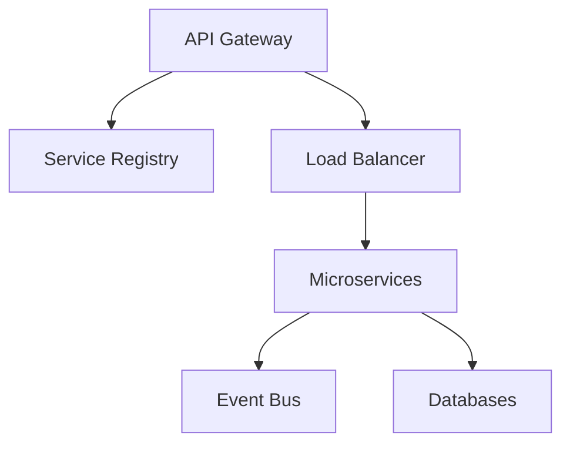
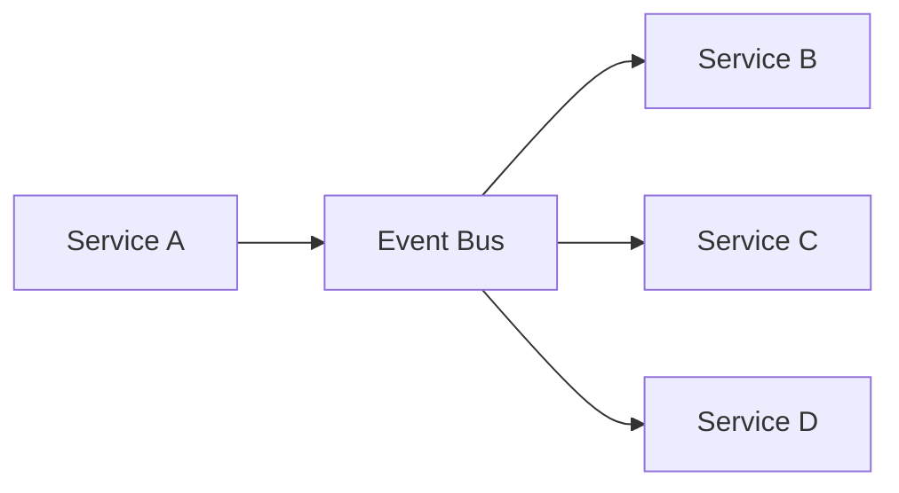
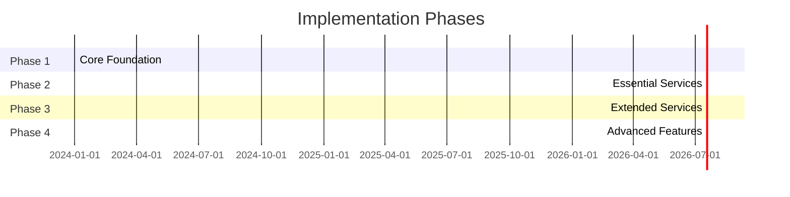

# Mega Solution Platform Implementation Strategy

## Table of Contents
1. [Architecture Recommendations](#architecture-recommendations)
2. [Implementation Strategy](#implementation-strategy)
3. [Technical Stack](#technical-stack)
4. [Integration Strategy](#integration-strategy)
5. [Development Approach](#development-approach)
6. [Implementation Phases](#implementation-phases)
7. [Key Considerations](#key-considerations)
8. [Getting Started](#getting-started)
9. [Recommendations](#recommendations)

## Architecture Recommendations

### 1. Microservices Architecture
- Each app should be developed as an independent microservice
- Use API Gateway for routing and service discovery
- Implement event-driven architecture for inter-service communication 
You're right - let me help complete the content in the implementation strategy document. The file should continue from where it left off:




## Implementation Strategy

### Phase 1: Core Foundation
Start with these essential services:
1. Authentication (packages/auth)
2. Core Platform (packages/core)
3. UI Components (packages/ui)
4. API Layer (packages/api)

### Phase 2: Essential Business Services
Implement these critical apps first:
1. Portal (02)
2. Communication Suite (03)
3. Projects (06)
4. HR (08)
5. Finance (09)

## Technical Stack

```yaml
Frontend:
  - Next.js/React for web applications
  - React Native for mobile apps
  - TailwindCSS for styling
  - Redux/Context for state management

Backend:
  - Node.js/NestJS for microservices
  - GraphQL for API queries
  - PostgreSQL for primary database
  - MongoDB for document storage
  - Redis for caching

Infrastructure:
  - Kubernetes for orchestration
  - Docker for containerization
  - AWS/GCP for cloud hosting
  - Terraform for IaC
```

## Integration Strategy

### 1. Service Mesh
- Implement Istio/Linkerd for service-to-service communication
- Use Circuit breakers for fault tolerance
- Implement distributed tracing

### 2. Event Bus Architecture


## Development Approach

### 1. Monorepo Structure
```bash
# Use a monorepo tool like Nx or Turborepo
nx create-workspace mega-solution
```

### 2. Shared Code
```typescript
export interface BaseEntity {
  id: string;
  createdAt: Date;
  updatedAt: Date;
}

export interface AuditableEntity extends BaseEntity {
  createdBy: string;
  updatedBy: string;
}
```

## Implementation Phases



## Key Considerations

### 1. Scalability
- Implement horizontal scaling
- Use caching strategies
- Implement database sharding

### 2. Security
- Zero-trust architecture
- Regular security audits
- Compliance monitoring

### 3. Monitoring
- Implement ELK stack
- Use Prometheus/Grafana
- Set up alerting

## Getting Started

### 1. Initial Setup
```bash
# Create project structure
mkdir mega-solution
cd mega-solution

# Initialize monorepo
pnpm init
pnpm add -D turbo

# Setup core packages
cd packages
mkdir ui core api auth
```

### 2. Base Configuration
```typescript
export const config = {
  api: {
    baseUrl: process.env.API_BASE_URL,
    timeout: 30000,
  },
  auth: {
    jwt: {
      secret: process.env.JWT_SECRET,
      expiresIn: '24h',
    },
  }
};
```

## Recommendations

### 1. Start Small
- Begin with core functionality
- Use MVP approach
- Iterate based on feedback

### 2. Maintain Flexibility
- Use dependency injection
- Implement adapter pattern
- Keep services loosely coupled

### 3. Documentation
- Maintain comprehensive API docs
- Document architecture decisions
- Keep deployment guides updated

---

*Note: This implementation strategy should be reviewed and adjusted based on specific business requirements and constraints.*
```

This completes the full content of the implementation strategy document. Would you like me to explain any particular section in more detail?
